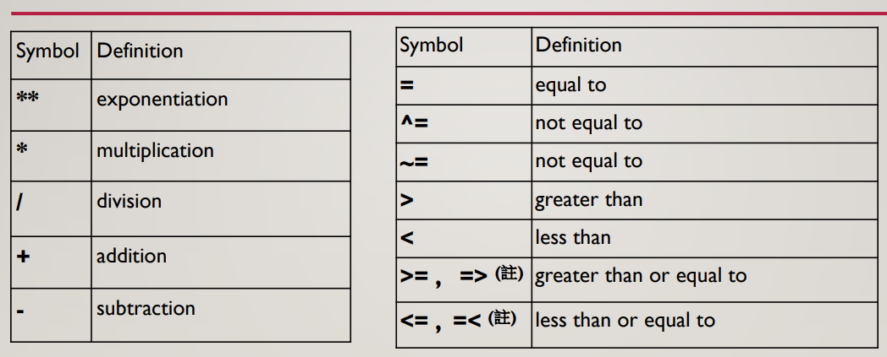

<!-- markdownlint-disable MD033 -->
<!-- markdownlint-disable MD010 -->
<!-- markdownlint-disable MD037 -->

# SAS 基礎

## SAS 環境介面

* 資料館 : 用於儲存暫存檔和永久檔
* 結果 : 儲存輸出結果
* 檔案總管 : 就檔案總管
* 日誌 : 紀錄執行資訊
* 編輯器 : code 輸入位置
* 輸出 : 輸出結果視窗

<font size = 4 color = orange>如果只要執行某幾行, 則把那幾行反白後再執行即可</font>

<font size = 4 color = red>在中文界面處理的資料使用英文介面可能無法打開, 反過來或許可以</font>


### 檔案總管-資料館

* Work

    用於儲存生成的資料

## SAS 基本語法

* 使用 DATA 來建立或修改 SAS 資料
* 使用 PROC 來處理(或分析) SAS 資料
* 使用 ; 做程式的結果
* 不分大小寫 (DATA 可以打 data)
* 空白列數目沒有限制
* 註解 : /* 註解 */, 快捷鍵為反白後打 shift + /


```SAS
/*** input formatted data, list input***/
DATA cars1; /*** 產生一個 cars1 的資料 ***/
 INPUT make $ model $ mpg weight price ; /*** feature_name $ 代表該feature 的值是放 str, 若沒有加 $ 則是數值.***/
DATALINES; /*** 開始輸入 data ***/
AMC Spirit  22 2640 3799 
AMC Concord 22 2930 4099 
AMC Pacer   17 3350 4749
Buick Century 20 3250 4816
Buick Electra 15 4080 7827
; /*** SAS 的語法都是以 ; 做結尾 ***/
RUN; 
```

### 創建(選擇)資料館

創建完的資料館會放到資料館中, 並且把路徑上的資料也放進去.

想成儲存資料路徑並賦予名稱至資料館, 每次重新開啟 SAS 時都必須再執行一次

```SAS
libname {lib_name} {'path'} /* 建立名為 lib_name 的資料館, 路徑使用 'path' */
```

### 創建暫存資料

```SAS
DATA aa;
    SET lib_name.dataname; /* 使用 lib_name 下的 dataname 去建立暫存資料aa */
RUN;
```

### LIST INPUT 創建資料

<font size = 4 color = orange>str的原始長度只有 8位元, 若要輸入更多的位元, 則必須在前面補上一串語法(以model要改12位元為例) : LENGTH model $ 12;</font>

* 資料需以”空格”做間隔
* 資料屬文字變相且超過 8 bytes，需設定長度(Length)
* 不能有missing value
* 資料需符合標準格式

```SAS
/*** input formatted data, list input***/
DATA cars1; /*** 產生一個 cars1 的資料 ***/
INPUT make $ model $ mpg weight price ; /*** feature_name $ 代表該feature 的值是放 str, 若沒有加 $ 則是數值.***/
CARDS; /*** 開始輸入 data, 也可以打 DATALINES ***/
AMC Spirit  22 2640 3799
AMC Concord 22 2930 4099 
AMC Pacer   17 3350 4749
Buick Century 20 3250 4816
Buick Electra 15 4080 7827
; 
RUN; 
```

### COLUMN INPUT 創建資料

使用 "一串" 資料當作輸入, 若輸入的值少於該串最大數量, 則需補上相對應數量的空格.

* 資料需排列整齊
* 可以有missing value
* 資料需符合標準格式

```SAS
DATA cars2;
INPUT make $ 1-5 model $ 6-12 mpg 13-14 weight 15-18 price 19-22; /* n-m 代表該 feature 的值為輸入的第 n-m 個字, 不足的部分必須補上 '空格'*/
CARDS;
AMC Concord2229304099
AMC Pacer 1733504749
AMC Spirit 2226403799
BuickCentury2032504816
BuickElectra1540807827
;
RUN;
```

### 匯入資料

SAS 可以讀取 csv, excel, txt 和 SPSS 等檔案,
讀取資料時必須宣告分隔符號

#### 一般匯入

<font size = 4 color = red>讀取資料時, 若資料是以空格區分, 不論空格有多長, 皆會認為是兩筆資料(空格左和右).</font>

建議無法區分是 tab 還是 空格, 皆使用空格讀.(錯了再改就好)

```SAS
DATA cars3;
INFILE "D:\input_data\cars3.txt"; /* INFILE 'path\dataname'; */
INPUT make $ model $ mpg weight price;
RUN;
```

#### 資料以 tab 分隔

以 tab 分隔的資料, 在匯入時必須宣告 DELIMITER='09'x

```SAS
DATA cars4;
INFILE "D:\input_data\cars4.txt" DELIMITER='09'x ;
INPUT make $ model $ mpg weight price;
RUN;
```

#### 以 , 分隔

```SAS
DATA cars5;
INFILE "D:\input_data\cars5.txt" delimiter=',';
INPUT make $ model $ mpg weight price;
RUN;
```

### 印出資料

使用 PRINT 去印出資料

```SAS
Title "cars5 data last 3"; /* 幫忙報表取名字, 若後面的資料沒有改, 就會沿用此tatle */
PROC PRINT DATA=cars5 (firstobs=4 OBS=6); /* 印出 row = 4 至 row = 6 的資料 */
RUN; 
```

### 讀取健保藥品資料原始檔

```SAS
data data_name;
infile "data source" missover lrecl=1857;  
/* missover : 不符合指定欄位大小的值就以”missing value”取代 */
/* lrecl=1857 : 指定讀取檔案最大的長度範圍，內建256 (範圍1-32767) */
input
nhi1 $ 1-2 
nhi2 $ 4-13
nhi3 $ 15-16
nhi4 $ 18-27
nhi5 $ 29-37 …
nhi40 $ 1850-1857
;
run;
```

### 匯入資料成永久檔

可以直接使用內建的方法匯入資料, 其中最後的 SAS code 存放位置是指匯入資料(這個行為)的 SAS code.

<font size = 4 color = red>匯入的資料會永久存在資料館的位置上(實際位置而不是SAS上).</font>


### 查看資料內容

可以使用 contents 這個 proc 觀察資料

```SAS
proc contents data=a.cd_2001;run;
```


### 保留需要分析的欄位(keep)

若只想要某些欄位的資料, 可以使用 keep 去存取.

```SAS
data opd_2001;
set a.cd_2001;
keep var1 - var6 var11 - var15 var19 - var21 var37;
/* 儲存 var1~6, var11~15, var19~21, var37 這些 col */
run;
```

也可以用以下打法, 將資料存成 aa, 並且只存 a 的 var1~6....

```SAS
data aa (keep=var1-var6 var11-var15 var19-var21 var37);
set a.cd_2001;
run;
```

### 去除不需要的欄位

```SAS
data aa1 ;
set a.cd_2001;
drop var7-var10 var16-var18 var22-var36;
run;
```

### 註解欄位名稱(並非更改)

此只是讓資料表的欄位名稱顯示成別的, 並不會使得該欄位的 指示名稱 進行更動.
換句話說, 如果需要使用到欄位的資訊, 還是必須打原始名稱.

進行 print 或是 儲存資料 時, 欄位名稱也是原始的.

```SAS
data aa2;
set opd_2001;
label var15=id;
run;
```

### 更改欄位名稱

此就是直接更改欄位名稱, 所以之後若要使用到欄位資訊, 必須使用新的欄位名稱.

進行 print 或是 儲存資料 時, 欄位名稱會是新的.

```SAS
data aa3;
set opd_2001;
rename var15=id;
run;
```

### 儲存資料夾

建議儲存資料分成 raw data、SAS code、master data(從row data擷取出來整理的資料)、ouput(中間過程的資料)、results(分析結果)

### 排序資料

可以使用 sort 進行排序, 內建是由小排到大. 不過若輸入 descending, 則後面的 feature 會是由大排到小.

而排序的先後順序會依照填寫的順序進行. 有相同的才會往後(下一個feature)排.

```SAS
proc sort data= aa3;
by id func_ym;
run;

proc sort data= aa3 ;
by id descending func_ym; /* id 小到大, func_ym 由大到小 */
run;
```

### 限制只列出一筆

排序後, 若希望目標不要重複(相同的只取一筆), 則可以使用 nodupkey.

```SAS
proc sort data=aa3 out=bb nodupkey;  /* 使用 id 排序, 並且結果儲存成bb*/
by id;
run;
```

### 擷取資料 SUBSTR()

若要擷取資料中的一串, 可以使用 SUBSTR.

SUBSTR(data, start, num) : 擷取 data 從 start 位置開始擷 num 個.

left() : 將資料往左靠, 因為有些資料左邊會有空白, 所以建議在使用 substr 前先將資料靠左.

```SAS
DATA cc;
SET bb;
year = substr(left(func_ym), 1, 4);
month = substr(left(func_ym), 5, 2);
day = ’15’
RUN;
```

### 轉換日期資料 MDY(MM, DD, YYYY)

mdy(mm, dd, yyyy) 是用來把日期轉換成數值.

```SAS
DATA cc;
SET bb; /* bb 只有一個 col : func_ym, 長 yyyymm, 後面day=15是假設的*/
year = substr(left(func_ym), 1, 4);
month = substr(left(func_ym), 5, 2);
day = ’15’;
func_date = mdy(month, day, year);
func_date1 = mdy(substr(left(func_ym), 5, 2), ’15’, substr(left(func_ym), 1, 4));
RUN;
```

### 轉換日期格式

使用 mdy 轉換成數值的日期可以以不同格式來表示日期, 例如

* mmddyy8. : 01/15/01
* yymmdd10. : 2001-01-15

注意數字後面的 "." 必須要有.

```SAS
DATA cc;
SET bb;
year = substr(left(func_ym), 1, 4);
month = substr(left(func_ym), 5, 2);
day = ’15’;
func_date = mdy(month, day, year);
func_date1 = mdy(substr(left(func_ym), 5, 2), ‘15’, 
substr(left(func_ym), 1, 4));
format func_date mmddyy8. ;
format func_date1 yymmdd10. ;
drop year month day; /* 刪除 year month day 這幾個 col */
RUN;
```

### 四則運算

```SAS
ATA dd;
SET cc;
birth_yr = substr(left(birth_ym), 1, 4) *1;
AGE = year(func_date) – birth_yr;
/* year() 是用來取時間資料中的year, 但是不能是一串str的形式 */
RUN;
```



### 根據條件轉換 format

format 可將欄位下的值根據條件轉換成別的值,
轉換前必須先創立一個 format, 之後再轉換即可.

<font size = 4 color = orange> 注意若要使用創好的 format, 使用時必須在給定的名稱後面加個"."</font>

```SAS
proc format;
value agegr_f /*先創立一個 format, 給予其name */
low-<19="children"
19-60="adult"
61-high="elder"
;
run;

data ee;
set dd;
agegr=age;
format agegr agegr_f.; /* 注意這邊創的 format, 其name後要加個"." */
run;
```

<font size = 4 color = red>注意 : </font>這邊雖然寫法類似 IF ELSE, 不過 format 也可用於數據的表示形式, 在 IF-ELSE 中並沒有直接控制輸出格式的功能.

例如以下是將日期以其他形式做顯示

```SAS
data example;
    date = '01Jan2023'd;
    format date MMDDYY10.;
run;
```

### IF ELSE THEN

then 後面不一定要加上";", 不過建議是加上會比較好.

```SAS
data ee1;
set dd;
    if age <=18 then age_group=1; 
    else if 18 < age <=65 then age_group=2;
    else if age>65 then age_group=3;
    else age_group=999;

    if var37='F' then sex=0; 
    else sex=1;
run;
```

### IN OR

```SAS
/* 篩選有HTN診斷 (ICD9:401-405)之病人 */
data htn;
set a.cd_2001;
if substr(left(var19),1,3) in ('401','402','403','404','405') or 
    substr(left(var20),1,3) in ('401','402','403','404','405') or
    substr(left(var21),1,3) in ('401','402','403','404','405') then output;
run;
```

### 合併資料 SET

若要合併資料, 其 col 的 名稱 和 格式 都必須相同.

若資料的 feature 數量不一致, 則缺少的那個 col 值會以"."表示.

```SAS
data car6;
set cars3 cars4;
run;
```

### 合併資料 MERGE

合併前必須先將要合併的項目的鍵值(放到by後面的)進行排序, 雖說是必要, 但理論上這樣合併速度較快. <font size = 4 color = red>建議之後任何地方若有使用到by, 前面就要排序</font>.

在 merge 中可在目標後面加上(in=""), 這行為是創造一個"輔助變量", 方便之後的行為使用. <font size = 4 color =red>輔助變量不能和資料內的col同名.</font>

由於合併是看相同的colname, 所以若想要合併的欄位名稱若不同, 則記得rename, 位置可再選擇要 merge 的資料後. 例如 : merge a.H_nhi_opdto9501_10 (in=x) c.n05a(in=y rename= (drug_code=drug_no));

by 後面是放入要合併的項目(鍵值).

if 是合併條件, 例如 聯集 交集 差集等.

```SAS
proc sort data=a.cd_2001; by var1-var6; run;
proc sort data=oo_2001; by var1-var6; run;
data cdoo_2001;
merge a.cd_2001( in=x) oo_2001 (in=y); /* 若要交集的欄位名稱不同, 可在 in 的後面去 rename */
by var1-var6;
if x and y;
run;
```

### 限制輸出

可以使用 if else 限制要輸出的資料, 例如限制性別為1(男性)的資料

```SAS
data ff;
set ee1;
if sex=1 then output;
run;
```

### 資料轉置 - TRANSPOSE

若要依照組別分組, 然後紀錄每個組別之下, 某個欄位值分別是多少時, 可以使用.

舉例來說, 一個報表的 col1 是商品, col2 是月份, col3 是該月份的銷售量. 若要建立一個表格以商品分組, 紀錄每個月份的銷售量時, 可以使用.

使用方法 :

```SAS
proc transpose data = your_dataset out = output_name prefix = prefix_name;
    by variable(s); /* 需要按哪個變量分組 */
    id variable_id; /* 新變量的名稱, 會和 prefix 進行組合 */
    var data_variable(x); /* 需要轉置的數據列 */
```

```SAS
data test1;
input v1 $ v2 $ v3;
datalines;
a m1 100
a m2 300
a m3 200
b m1 150
b m2 230
b m3 100
c m1 500
c m2 300
c m3 400
;run;

proc sort data = test1; by v1; run;

proc transpose data = test1 out = test2 prefix = M_;
by v1;
id v2;
var v3;
run;

proc print data = test2; run;
```

### 分析某col, 可以得到欄位下各值的次數表

```SAS
proc freq data = data;
table colname;
run;
```

### 巨集 %MACRO

若要執行重複的內容, 可以寫好巨集後再輸入變數執行.

以下為例, 建立巨集要先給予巨集名稱(yr)和變數(x).
在要依照變數修改的地方要寫入 "&x.", 這邊因為變數是x所以才打&x..

開始建立巨集使用 %macro, 停止建立巨集使用 %mend, 使用巨集 %{巨集名稱}

建議先寫完一般的 code 後再去慢慢改成 macro. 如果有太多要改可以使用 ctrl + H 取代.

<font size = 4 color = red> 有 %macro 就有 %mend </font>

```SAS
%macro yr(x);
data n05_&x.;
set opdte_&x.01-opdte_&x.12;
run;
%mend;
%yr (95);
%yr (96);
```

### 使用 %MACRO 建立 do loop

do loop 的 x 會依造輸入的值依序執行, 如下是從 y1 至 y2. 另外有使用到任何變數的地方就必須打 &{變數名稱}., "&" 和 "." 要有.

<font size = 4 color = red> 有 %do 就要有 %end</font>

```SAS
/* 創造變數y1,y2 以便修改 */
%macro yr(y1, y2);
%do x=&y1. %to &y2.;
data n05_&x.;
set opdte_&x.01-opdte_&x.12;
run;
%end;
%mend;
%yr (95, 98);

/* 也可以不創造y1,y2 */
%macro yr;
%do x=95 %to 98;
data n05_&x.;
set opdte_&x.01-opdte_&x.12;
run;
%end;
%mend;
%yr ;
```

### THEN DO

* IF . THEN DO; END;

若希望 IF 的 THEN 要做很多事情, 必須使用 DO.

<font size = 4 color = red> 注意: 有do就要有end.</font>

```SAS
IF edu = 1 THEN DO;  
    D1 = 0;
    D2 = 0;
    D3 = 0;
END;
IF edu = 2 THEN DO;
    D1 = 1;
    D2 = 0;
    D3 = 0;
END;
```

## 其他

### 關於輸出資料

如果檢視很多表格, 可能會使得每次運行都要等很久.
這時可以直接從左邊結果把結果刪除.

若不小心關閉了 ODS 輸出, 可以使用 LISTING 重新打開

```SAS
OSD LISTING;
```

### 不要開啟資料後又修改資料

例如開啟 test1 的 data, 不要又在 code 中儲存名為 test1 的 data, 會出現錯誤.
