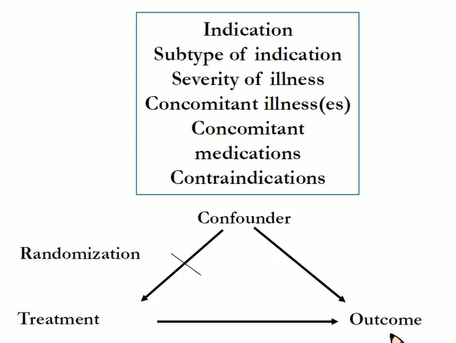
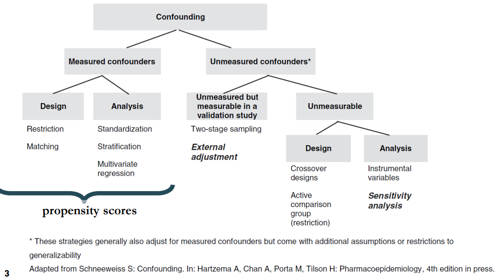
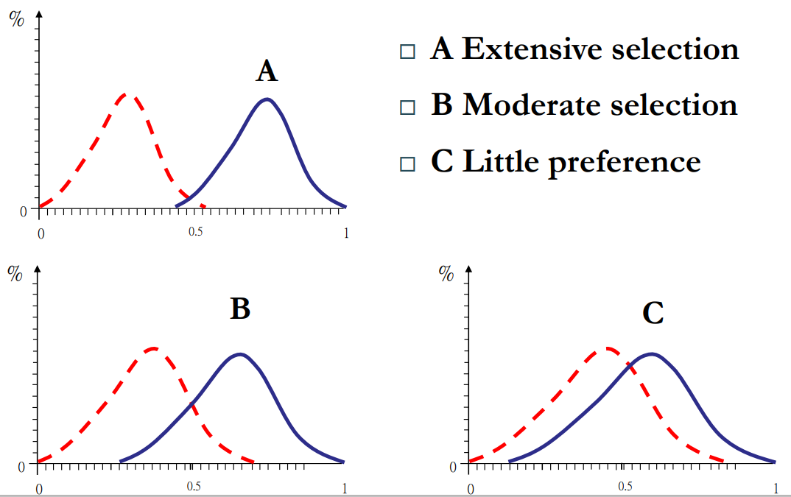
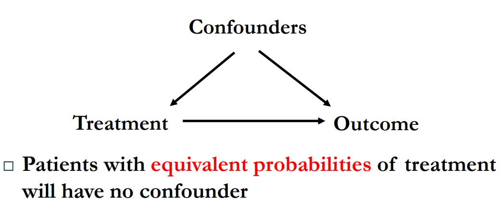
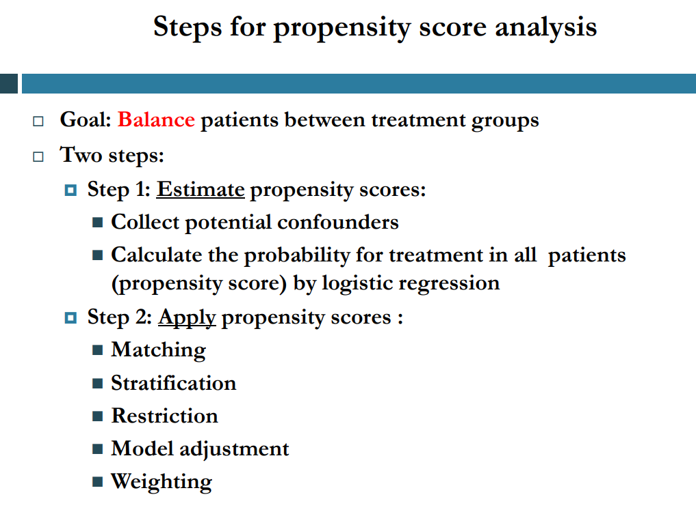
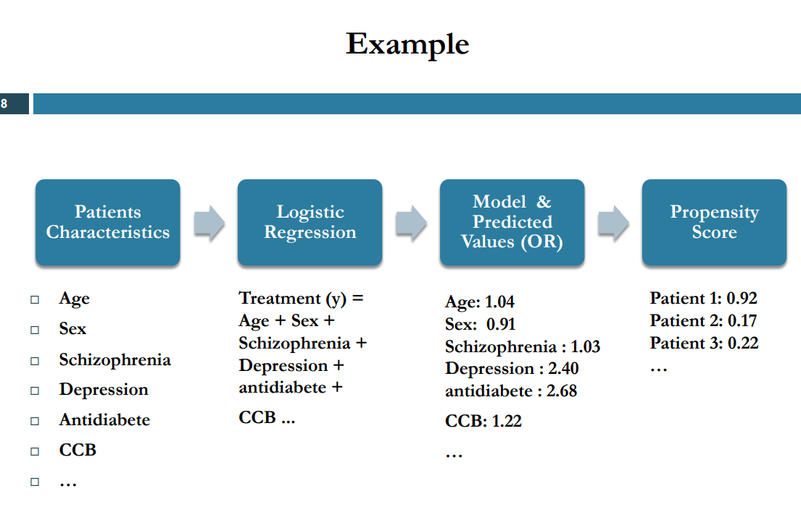
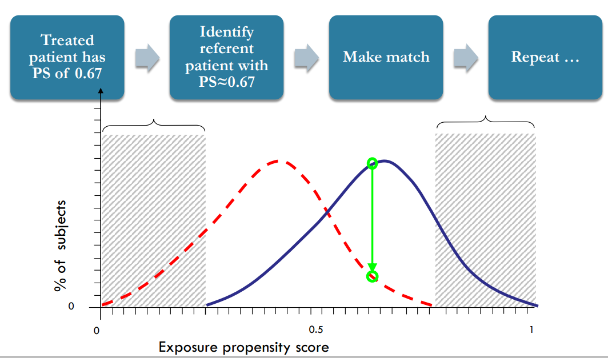
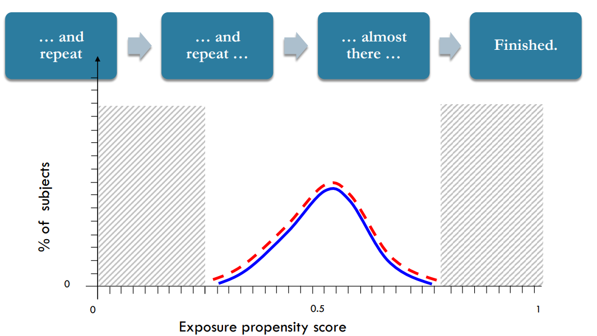
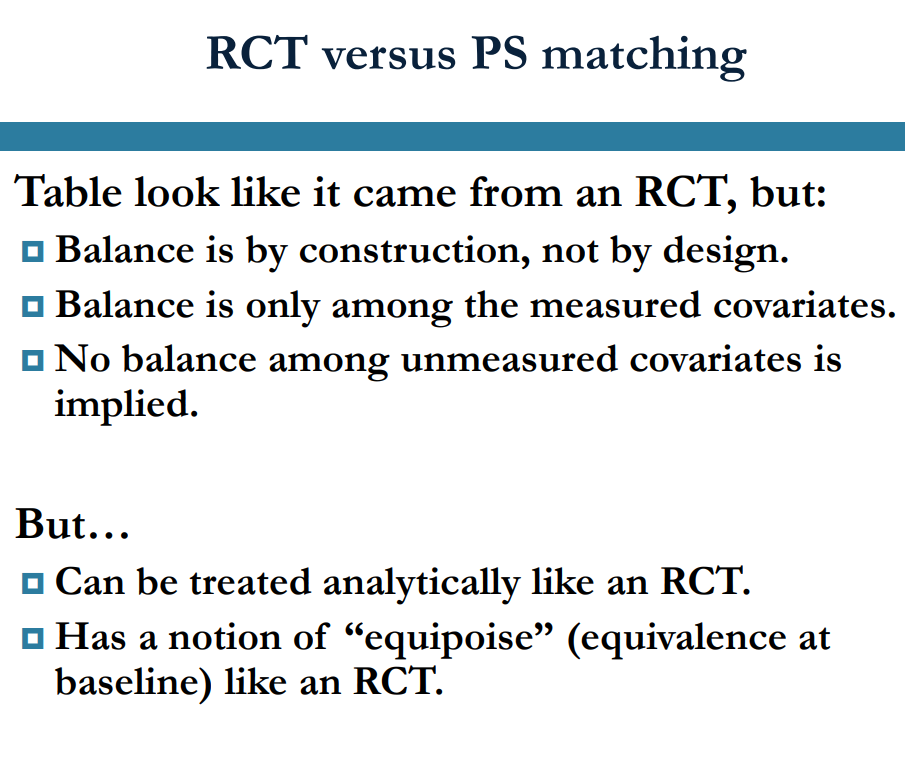

<!-- markdownlint-disable MD033 -->
<!-- markdownlint-disable MD010 -->
<!-- markdownlint-disable MD037 -->

# Propensity Score

PS 有很多方法可以應用, 此只講 matching 的應用.

PS 目的 : 讓資料很像 RCT(隨機對照試驗), 也就是治療組和非治療組很像.

PS 值的計算方法 : 收集可能測量的干擾因子, 利用羅吉斯回歸去計算得到的機率.

<font size = 4 color = red> 既然是使用羅吉斯得到的機率值一樣或近似的配對, 其實也可以說是 PS 的目的是找個體差異較小的治療與非治療組. 既然這樣為什麼不用 KNN? 當然也有可能說 KNN 因為要找相近的資料必須每個都計算其距離, 不過應該如果給定某些特定重要的點(例如年齡性別等), 可能可以縮短計算時間? </font>

## 基本介紹

要去驗證藥品的療效跟安全性最理想的情況就是做 RCT(隨機對照試驗, randomized controlled trial). 但基本上很難去執行.

觀察性研究最容易遇到的問題是干擾因子的影響. 例如要研究抽菸和肺癌的關係, 則必須先知道喝酒是否在兩者之間的分布也相同.



Confounder : 干擾, 分為可以測量和不可測量兩種



PS 只能針對可以測量的 Confounder. 其作法是針對<font size = 3 color = red>可以測量的資料</font>去<font size = 3 color = red>預測這個病人接受治療的機率</font>有多高.

計算 ps 的機率後, 得到的分布必須是近似的. 如下圖, A 不適合; B 適合. 此圖的 X 軸為機率, Y 軸為人數多寡.



PS 的目的是讓資料很像 RCT, 也就是切除 干擾 與 治療 間的關係. 而執行的方法就是配對, 把 PS 分數相等或相近的人配在一起, 之後會得到新的治療/非治療組, 再進行分析.



## 例子

step 1 : 計算每個病人的 PS

* 收集所有可能測量的到的干擾因子.
* 透過 羅吉斯回歸 去計算出每個人接受治療的機率.

step 2 : 利用 PS 值去做分析

* Matching : 找最接近的人配對, 比例多少都可以 (此建議 1人:4人)
* Stratification(分層) : 依照 range 去分組.
* Restriction(限制) : 限制只要哪個 range.
* Model adjustment : 把 PS 變成一個單獨的連續型變相, 放入自己建立的模型之中.
* Weighting



計算時, y 為 Treatment(治療與否)



計算完 PS 後, 就可以計算得出兩組(治療與否)是否相似. 然後再依據治療/非治療組, 每個PS值的位置去找到對應的非治療/治療組的人進行配對(例如1個治療配4個非治療). 最後得到的新的治療與非治療組, 其分布圖會近似(如下兩張圖).





所以要進行 PS 的話, 必須要是 計算PS值時分布越近越好 跟 matching 後 分布要近似. 也就是說, 最好在執行時要繪圖出來.

## PS 的優缺點

### 優點

1. 平衡患者特徵
    * 提高估計的有效性

### 缺點

1. 會失去data : 因為不是每個 data 都能被 matching 到.
    * 估計精確性變差
    * 應用性變差 : 無法回答原來的 data 的狀況

## 比較 RCT 和 PS



## SAS code

創建 lib

```SAS
/* 將路徑儲存於一個變數中 */
%let my_path = 'lib_path'

/* 使用變數設置 lib */
libname DemoData &my_path /* 練習的 code 是寫成 b, 如果後面有使用 b. 取資料的話就是指這邊的 DemoData. */
```

計算 Ttest, 查看 不同用藥的 age 是否有顯著差異

```SAS
data DemoData.demo2;
    set DemoData.demo;
    if eligibility=1 and  pastuser=0; /* 健保期間內, 且為新用藥 */
    stroke_outcome=0;
    if event='stroke' then stroke_outcome=1; /* 含前一行, 有 stroke 的為1, 沒有的為0 */
    if ID_S=1 or ID_S=2; /* 只取有 性別 的(9為遺漏值) */
run;
```

上面的 code 理論上可以改成

```SAS
data DemoData.demo2;
    set DemoData.demo;
    stroke_outcome = 0;
    if (eligibility=1 and  pastuser=0) and (ID_S=1 or ID_S=2);
    if event='stroke' then stroke_outcome=1; /* 含前一行, 有 stroke 的為1, 沒有的為0 */
run;
```

可以用以下 code 觀察是否相同

```SAS
proc compare base = dataset1 compare = dataset2;
run;
```

檢定兩組的差異程度

```SAS
proc ttest data = DemoData.demo2; class index_class; var age;run;

proc freq data = DemoData.demo2;
table
    (ID_S

    Schizophrenia
    Depression
    Dyslipidemia
    IHD
    HTN
    COPD

    antidiabete
    Statin
    diuretic
    betablocker
    CCB
    )* index_class  /chisq;
run;
```

使用 logistic 計算 PS

```SAS
proc logistic data=b.demo2 descending ; /* descending 控制顯示參數時的排序方式(按照估計值的大小) */
class  index_class (ref='FGA')  ID_S (ref='1') /* 這邊要把類別行變數放上來, 並且設定好 reference */
/param=ref; /* 特定參數基準值 */
/* 在 SAS 中, '/' 通常用於指定 proc 的選項, 例如控制輸出和圖形格式 */
model  index_class= /* 設定模型 目標變數(因變量) 和 解釋變數(自變量) */

    age ID_S

    Schizophrenia
    Depression
    Dyslipidemia
    IHD
    HTN
    COPD

    antidiabete
    Statin
    diuretic
    betablocker
    CCB

/ /* 在 SAS 中, '/' 通常用於指定 proc 的選項, 例如控制輸出和圖形格式 */
link=glogit /* link 用來指定模型的連結函數, 連結函數決定了應變數和自變數的關係. 其中, glogit 是進行多類別的 logistic 回歸時使用的連結函數之一, 它代表了 generalized logit 函數. */
selection=stepwise lackfit ; /* 設定羅吉斯回歸的選擇變相方法 */
OUTPUT OUT= ps prob=prob ; /* 設定 output 檔名稱和位置, 另外多一個 col 名叫 prob, 用來放 prob */
title "Propensity Score for SGA";
RUN;
```

沒註解版

```SAS
proc logistic data=b.demo2 descending ; 
class  index_class (ref='FGA')  ID_S (ref='1') 
    /param=ref; 

model  index_class = 
    age ID_S

    Schizophrenia
    Depression
    Dyslipidemia
    IHD
    HTN
    COPD

    antidiabete
    Statin
    diuretic
    betablocker
    CCB

    /
    link=glogit
    selection=stepwise lackfit;
OUTPUT OUT= ps prob=prob ;
title "Propensity Score for SGA";
RUN;
```

確認分布預測的狀況

利用繪圖去確認, 先把不同 label 的分開標示.

```SAS
/*check PS distribution*/
data plot1; set  ps;
if index_class='SGA' then treated_ps=prob; else treated_ps=.;
if index_class='FGA' then untreated_ps=prob; else untreated_ps=.;/*reference: FGA*/
run;
```

進行繪圖

```SAS
ODS GRAPHICS ON; /* 啟用 SAS 的圖形輸出功能 */
PROC KDE DATA=plot1; /* KED(Kernel Density Estimation, 核密度估計) 是一種用於估計隨機變數機率密度函數的無母樹方法. 這邊單純只是為了繪製出各個機率的密度圖, 用來檢查看是否可以很好的去進行 match. */
    UNIVAR untreated_ps treated_ps / PLOTS=densityoverlay;
    /* univar 用於指定進行核密度估計的變量 */
    /* PLOTS = densityoverlay 為告訴 SAS 要繪製的圖形是密度疊加圖, 也就是兩個 label 繪製在同一張圖上. */
TITLE "Propensity score distributions by treatment group";
RUN;
ODS GRAPHICS OFF; /* 關閉. 當完成繪製或不需要輸出圖時使用, 避免不必要的圖形輸出. */
```

從圖形可看出, 大部分都有 match 到, 所以推測可以使用.


診斷模型是否真的可以很好的預測

```SAS
ods graphics on;
proc logistic data=ps plots(only) = (roc(id= obs) effect);
    /* plots(only) : 用於指定繪製圖表類型, 不生成其他默認圖形 */
    /* roc(id=obs) : 生成 ROC 曲線圖, id=obs 指定使用觀察值得標示符 */
    /* effect : 生成估計效益圖 */
    class  index_class (ref='FGA')  ID_S (ref='1');
    model  index_class =
    age ID_S

    Schizophrenia
    Depression
    Dyslipidemia
    IHD
    HTN
    COPD

    antidiabete
    Statin
    diuretic
    betablocker
    CCB
    / link=glogit selection=stepwise lackfit 
    scale=none clparm=wald clodds=pl rsquare;
run;
ods graphics off;
```

從 P value 跟 ROC curve 都顯著(可以拒絕各特徵無法有效擬合這個虛無假設)


進行 PS match

```SAS
/*PS-match*/
data b.ps;
    set ps;
    if  index_class='FGA' then interven = 0 ;else interven = 1; /* 以 FGA 為參考組 */
run;
```

建立 MACRO 進行 match. <font size = 4 color = red> 這邊之後在解釋 </font>

```SAS
/* ************************************* */
/* Call statement for Greedy Match Macro */
/* ************************************* */

/* ************************************* */
/* Greedy 5->1 Digit Matching Macro (匹配至小數後幾位)*/
/* ************************************* */
%MACRO GREEDMTCH(
    Lib, /* Library Name */
    Dataset, /* Data set of all */
    depend, /* Dependent variable, (cases, controls) = (1, 0)*/
    matches /* Output file of matched */
    );

%MACRO SORTCC;
    proc sort data = tcases
    out = &LIB..Scase; 
	/*  &LIB..Scase 代表生成在 LIB 裡面, 並且資料名稱叫做 Scase. 
	    其中 LIB 是前面(MACRO GREEDMTCH) 設定變數時給定的, 
	    依照之後呼叫這個 MACRO 時使用的變數(第一格)改變. */
    by prob;
    
    proc sort data=tctrl
    out = &LIB..Scontrol;
    by prob randnum;
    run;
%MEND SORTCC;

/*  Macro to Create the initial
    Case and Control Data Sets */
%MACRO INITCC(digits);
    data tcases (drop=cprob)
         tctrl (drop=aprob) ;
    set &LIB..&dataset. ;

    /* Create the data set of Controls*/
    if &depend. = 0 and prob ne . /* 如果 depend = 0 且 prob 不等於 遺漏值 */
    then do;
        cprob = Round(prob,&digits.); /* 對 prob 進行四捨五入至 digits(此macro參數) 位數, 若是 .01 則是至小數後兩位. */
        Cmatch = 0;
        Length RandNum 8;
        RandNum = ranuni(1234567); /* 生成 0~1 的隨機數, 裡面的是種子碼 */
        Label RandNum=
        'Uniform Randomization Score'; /* 修改顯示名稱 */
        output tctrl;
    end;

/* Create the data set of Cases */
else if &depend. = 1 and prob ne .
then do;
Cmatch = 0;
aprob =Round(prob,&digits.);
output tcases;
end;
run;
%SORTCC;
%MEND INITCC;

/* Macro to Perform the Match */
%MACRO MATCH (MATCHED,DIGITS);
data &lib..&matched. (drop=Cmatch randnum
aprob cprob start oldi curctrl matched);
/* select the cases data set */
set &lib..SCase ;
curob + 1;
matchto = curob;
if curob = 1 then do;
start = 1;
oldi = 1;
end;
/* select the controls data set */
DO i = start to n;
set &lib..Scontrol point= i nobs = n;
if i gt n then goto startovr;
if _Error_ = 1 then abort;
curctrl = i;
/* output control if match found */
if aprob = cprob then
do;
Cmatch = 1;
output &lib..&matched.;
matched = curctrl;
goto found;
end;
/* exit do loop if out of potential matches */
else if cprob gt aprob then
goto nextcase;
startovr: if i gt n then
goto nextcase;
END; /* end of DO LOOP */
/* If no match was found, put pointer
Posters
back*/
nextcase:
if Cmatch=0 then start = oldi;
/* If a match was found, output case and
increment pointer */
found:
if Cmatch = 1 then do;
oldi = matched + 1;
start = matched + 1;
set &lib..SCase point = curob;
output &lib..&matched.;
end;
retain oldi start;
if _Error_=1 then _Error_=0;
run;
/* Get files of unmatched cases and */
/* controls. Note that in the example */
/* data, the patient identifiers are HID*/
/* (Hospital ID) and PATIENTN (Patient */
/* identifier. All cases have complete */
/* data for these two fields. Modify */
/* these fields with the appropriate */
/* patient identifier field(s) */
proc sort data=&lib..scase out=sumcase;
by id ;
run;
proc sort data=&lib..scontrol
out=sumcontrol;
by id;
run;
proc sort data=&lib..&matched. out=smatched
(keep=id matchto);
by id;
run;
data tcases (drop=matchto);
merge sumcase(in=a) smatched;
by id;
if a and matchto = . ;
cmatch = 0;
aprob =Round(prob,&digits.);
run;
data tctrl (drop=matchto);
merge sumcontrol(in=a) smatched;
by id;
if a and matchto = . ;
cmatch = 0;
cprob = Round(prob,&digits.);
run;
%SORTCC
%MEND MATCH;
/* Note: This section can be */
/* modified to try variations of the */
/* basic algorithm. */
/* Create file of cases and controls */
%INITCC(.00001);
/* Do a 5-digit match */
%MATCH(Match5,.0001);
/* Do a 4-digit match on remaining
unmatched */
%MATCH(Match4,.001);
/* Do a 3-digit match on remaining
unmatched */
%MATCH(Match3,.01);  
/* Do a 2-digit match on remaining
unmatched */
%MATCH(Match2,.1); 	
/* Do a 1-digit match on remaining
unmatched */
%MATCH(Match1,.1); 
/* Merge all the matches into one file */
/* The purpose of the marchto variable */
/* is to identify matched pairs for the*/
/* matched pair anlayses. matchto is */
/* initially assigned the observation */
/* number of the case. Since there */
/* would be duplicate numbers after the*/
/* individual files were merged, */
/* matchto is incremented by file. */
/* Note that if the controls file */
/* contains more than N=100,000 records*/
/* and/or there are more than 1,000 */
/* matches made at each match level, */
/* then the incrementation factor must */
/* be changed. */
data &lib..&matches.;
    set &lib..match5(in=a)
        &lib..match4(in=b) &lib..match3(in=c)
        &lib..match2(in=d) &lib..match1(in=e);
    if b then matchto=matchto + 100000;
    if c then matchto=matchto + 10000000;
    if d then matchto=matchto + 1000000000;
    if e then matchto=matchto + 100000000000;
run;
/* Sort file -- Need sort for Univariate
analysis in tables
*/
proc sort data=&lib..&matches. out =
&lib..S&matches.;
by &depend.;
run;
%MEND GREEDMTCH;

%GREEDMTCH (b, ps, interven , matchfile);

```

-3:33
